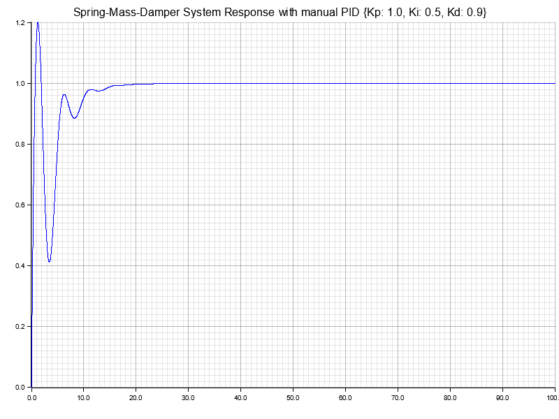
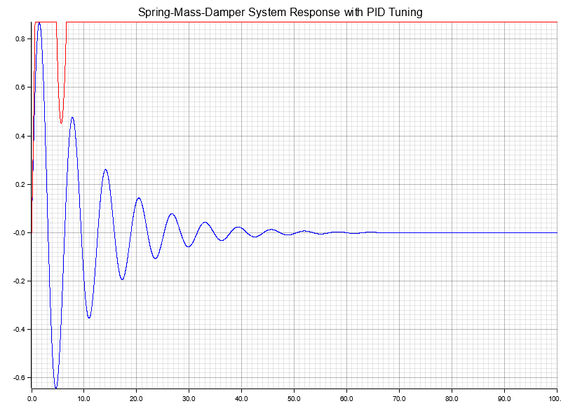

# Rust-Defferential-Equation-Solver
A differential equation solver using the Euler-Method. The current example simulates a spring-mass-damper system. The PID-Controller example has been implemented. The PID-Controller can be tuned using the Ziegler-Nichols method.

## Outputs
Free Response:

PID Response:

Tuned PID Response:

## Usage
Replace the equation in the main forloop at line 45 with your differential equation. The tuning will be done automatically. The PID-Controller can be tuned manually by changing the values in the PID-Controller at line 18-20. Setting the values to 0 will disable the PID-Controller, setting the "no_tuner" variable with disable the tuner.

## Features
- [x] Euler-Method
- [x] Spring-Mass-Damper Example
- [x] PID-Controller Example
- [x] PID Tuning with Ziegler-Nichols-Method
- [ ] Runge-Kutta-Method?