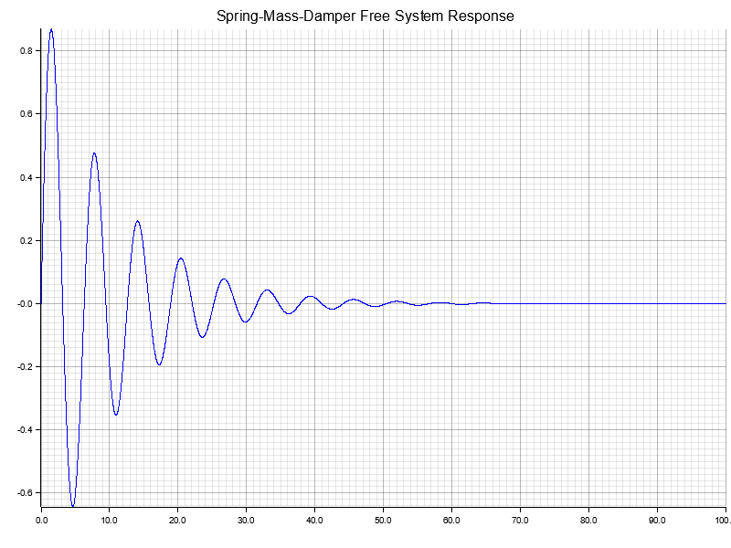

# Rust-Defferential-Equation-Solver
A differential equation solver using the Euler-Method. The current example simulates a spring-mass-damper system. The PID-Controller example has been implemented. The PID-Controller can be tuned using the Ziegler-Nichols method.

## Outputs

<!--  -->

## Features
- [x] Euler-Method
- [x] Spring-Mass-Damper Example
- [x] PID-Controller Example
- [x] PID Tuning with Ziegler-Nichols-Method
- [ ] Runge-Kutta-Method?